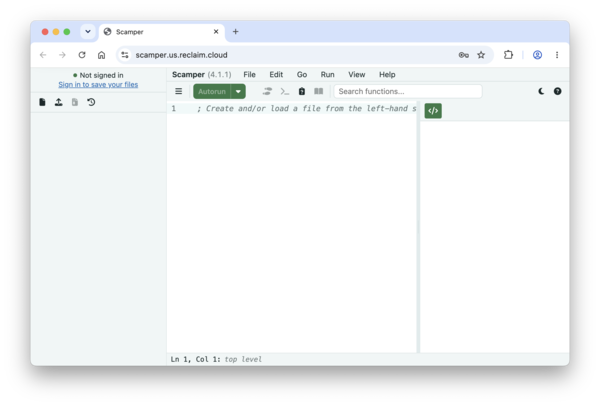
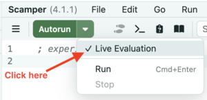
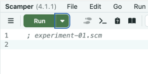
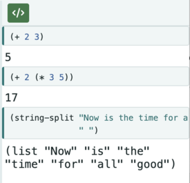
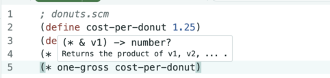
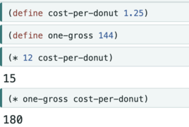
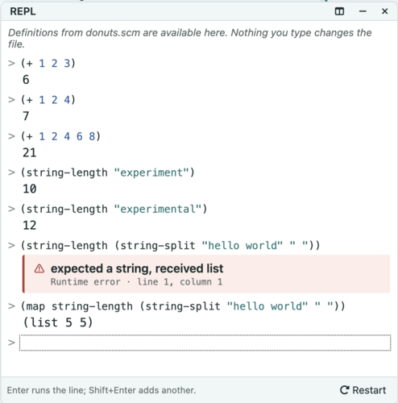

## Introduction: Program-development environments

As we've noted previously, while the core of computer science is the design of algorithms and data structures, one needs to express those algorithms in a form understandable to the computer (and, one hopes, to human beings).  We call this endeavor _programming_.  We refer to the algorithms so expressed as both _programs_ and _code_.

While it is possible to create programs in almost any text editor, more programmers develop their programs in what is normally called a program-development environment or integrated development environment (IDE).  These environments not only permit you to write programs, but also provide mechanisms for testing small parts of the programs, formatting the code for easy readability, obtaining documentation, and more.  In general, development environments support the other activities associated with program development.

In this course, you will use the _Scamper_ Web-based program-development environment.  Scamper was designed at Grinnell to support the teaching of programming, which means that it has many features that make it particularly amenable to novice programmers.

## Getting Scamper

Scamper is a Web-based IDE, so there's nothing to download to your computer. To access the Scamper IDE, visit <https://scamper.us.reclaim.cloud/>.

Since Scamper is on the Web, it does not have ready access to files on your disk. Hence, when programming in Scamper, it seems like you might need to upload files from your computer, do the work, and then download back to your computer. Perhaps you'll even need to copy and paste. Unfortunately, in early versions of Scamper, that was the main mechanism for dealing with files.

In Fall 2026, Scamper gained a cloud-based storage system. To store files in the Scamper cloud, you'll need a Scamper account. Ideally, your instructor will have provided you with an account and password. If not, please ask them for one.

## An overview of the Scamper user interface

At first glance, the Scamper user interface (UI) might look a bit daunting.

.

You may note that this window has three parts, which we'll call "panes".  The leftmost pane is the _File Browser_. Once you've logged in, you'll see a list of the files you've created. The middle pane is called the _Definitions Pane_ or _Definitions Window_, and is where you'll define functions and values. The righmost pane is called the _Results Pane_ and is where you'll see the results of your procedures.

## Detour: Getting started with the Scamper language

Scamper also has a few pop-up windows. If you click the `>_` button (greater-than underscore), a REPL window appears. REPL stands for "read-eval-print loop", and it's typically where you interact with or experiment with your programs. Hence, we'll often refer to that as the _Interactions window_ or _Interactions pane_

Scamper has a fairly simple syntax, but one that is different than most other programming languages.  Parentheses play an important role in Scamper (and most versions of Scheme).  To tell Rcket to apply a function to some arguments, you write an open (left) parenthesis, the name of the function, the arguments separated by spaces, and a close (right) parenthesis.  For example, here's how you would add 1, 2, and 3.

```drracket
(+ 1 2 3)
```

## The Scamper definitions pane

As we noted, the definitions pane is where you will typically define functions and values. In experimenting with the definitions pane, we'd suggest you start by turning off the "Autorun" feature by clicking on the downward arrow next to the green "Autorun" button and unselecting "Live Evaluation".



Once you've unselected "Live Evaluation", the "Autorun" button should now say "Run".



You can type both definitions and expressions in the definitions pane. For example, here are a few simple definitions and calculations, taken from the [introduction to Scheme](../readings/intro-scamper).


When you click the "Run" button, the results appear in the Results pane.



What about the "definitions" mentioned above? We write those with `(define NAME EXPRESSION)`. For example, here are some simple calculations to figure out the price of a dozen or gross of donuts.



And here are the results.



Wasn't that exciting? In any case, one of the advantages of definitions is that when a number changes (e.g., the price of donuts goes up), there's only one thing you need to update. Another is that using these names helps explain the definition. `(* one-gross price-per-donut)` clearly calculates the cost of a gross of donuts. On the other hand, it's not necessarily clear why we're computing `(* 144 125)`.

## The Scamper Interactions window

As we discovered in our initial investigation of algorithms, it's nice to be able to experiment. The Interactions window (or REPL window) is where you'll do much of your experimentation. The Interactions window differs from the Definitions pane in that each expression you type is evaluated immediately.


```

As the example may suggest, one nice part about this is it's easy to correct a mistake you've made and try again.

This style of interaction may feel a bit like a calculator with a strange user interface and a log of what you've done.  And, in some sense, that's one purpose of Scampers's interactions pane.  However, Scamper also provides a variety of features that may not be easily available in most calculators, such as support for values other than numbers (*e.g.*, the strings above), the ability to name values, and the capability for you to write your own operations (aka procedures).

## Autorun and the definitions pane

Some developers prefer to work in the definitions pane and have the computer check their work as they make changes. That model succeeds only if the program is simple enough and the computer is powerful enough that re-running the program regularly is not too costly.

In Scamper, you can turn on "Autorun" by checking the "Live Evaluation" menu item next to the "Run" button. (See above.) As you might expect, different people respond to this feature differently. Some prefer to develop without the continuous feedback, stopping only when they explicitly want to run the program. Others prefer to see that continuous feedback. Hence, Scamper provides both.

Note that the autorun feature is, in some sense, a hybrid of the two models. Like the interactions pane, it lets you quickly check things. Like the standard use of the definitions pane, it lets you work on things you intend to preserve. As the semester progresses, you should experiment with both and see which you prefer.

## Saving and restoring definitions

We noted that the definitions pane is intended for the work that you intend to be permanent, or at least less ephemeral than the work you do in the interactions pane.  Hence, we will regularly save the contents of the definitions pane to a file.  We can then restore those definitions at a later time.

By custom, we save Scheme files with a suffix of `.scm`.

Once you know that your definitions are safely stored in a file, you can quit Scamper, go off and do other work, and then restart Scamper to reload the definitions. Scamper takes an "autosave" approach to your files.

Text files that contain programs like our `.scm` files are frequently called *source files* as they contain the *source code* for our programs.  You will frequently hear us refer to the contents of the definitions pane and its associated file as a source file.

## Self Checks

You have now learned enough to interact with Scamper.  In the forthcoming lab, you will have the opportunity to ground those abstract instructions in concrete exercises.  Before you do so, you will find it useful to take a few quick notes on some issues.

### Check 1: What is Scamper?

In your own words, explain what Scamper is and why we use it in this course.

### Check 2: UI components

Explain a few of the UI components in the Scamper IDE.

### Check 3: File suffixes

What suffix should you use for your Scamper files?
